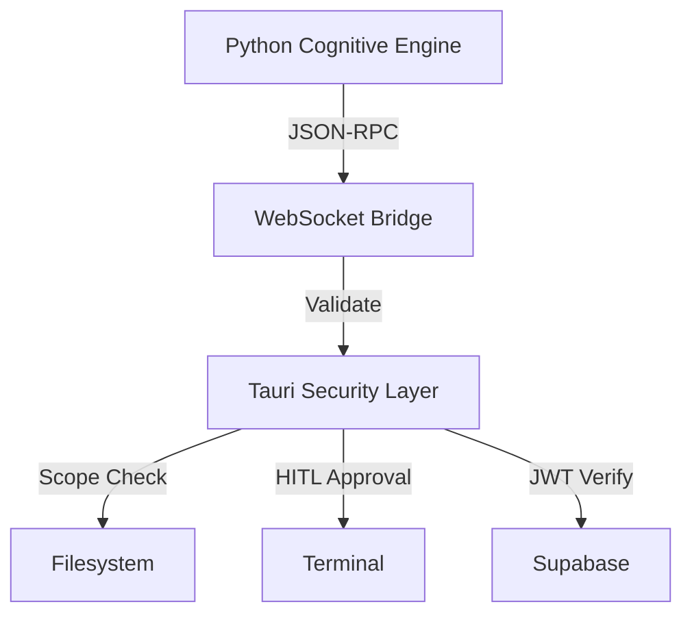

# Voco V2: System Security Document (SDD)

## 1. Zero-Trust Architecture

### Core Security Model



### Security Boundaries

#### Python Sandbox (Zero Filesystem Access)
- No direct disk operations
- All actions via JSON-RPC
- Stateless execution
- Request validation

#### Tauri Gateway (Enforced Scope)
```rust
// src-tauri/src/security.rs
pub fn validate_path(path: &Path) -> Result<(), Error> {
    let scope = app.fs_scope();
    
    // 1. Absolute path validation
    if !scope.is_allowed(path) {
        return Err(Error::ScopeViolation);
    }
    
    // 2. Symlink resolution
    let canonical = path.canonicalize()?;
    if !scope.is_allowed(&canonical) {
        return Err(Error::SymlinkEscape);
    }
    
    // 3. Parent traversal check
    if path.components().any(|c| c == Component::ParentDir) {
        return Err(Error::TraversalAttempt);
    }
    
    Ok(())
}
```

## 2. Human-in-the-Loop (HITL) System

### Command Risk Assessment

```rust
// src-tauri/src/commands.rs
fn assess_risk_level(cmd: &str) -> RiskLevel {
    match cmd {
        // Blocked: No approval possible
        c if c.contains("rm -rf") => RiskLevel::Blocked,
        c if c.contains("sudo") => RiskLevel::Blocked,
        c if c.contains("chmod") => RiskLevel::Blocked,
        
        // High Risk: Requires HITL
        c if c.contains("git push --force") => RiskLevel::High,
        c if c.contains("db:migrate") => RiskLevel::High,
        
        // Medium Risk: Notification
        c if c.contains("npm install") => RiskLevel::Medium,
        
        // Low Risk: Auto-approve
        _ => RiskLevel::Low,
    }
}
```

### Approval Flow

```typescript
// src/hooks/use-command-approval.ts
type CommandProposal = {
    id: string;
    command: string;
    risk_level: RiskLevel;
    approval_type: "voice" | "click";
    timeout_ms: number;
};

const requestApproval = async (proposal: CommandProposal) => {
    if (proposal.risk_level === "high") {
        // 1. Voice synthesis
        await tts.speak(`Requesting approval for ${proposal.command}`);
        
        // 2. Wait for voice response
        const approved = await waitForVoiceConfirmation(proposal.timeout_ms);
        
        // 3. Log decision
        await logAuditEvent({
            type: "command_approval",
            command: proposal.command,
            approved,
            method: "voice",
        });
        
        return approved;
    }
    
    // Click-through for medium risk
    return showApprovalDialog(proposal);
};
```

## 3. Authentication & Authorization

### JWT-Based Auth

```typescript
// src/hooks/use-auth.ts
const syncAuthState = async (session: Session) => {
    if (!session?.access_token || !session?.user?.id) return;
    
    // 1. Update WebSocket auth
    ws.send(JSON.stringify({
        type: "auth_sync",
        token: session.access_token,
        uid: session.user.id,
    }));
    
    // 2. Update Supabase RLS
    await db.auth.setSession({
        access_token: session.access_token,
        refresh_token: session.refresh_token,
    });
    
    // 3. Log auth event
    await logAuditEvent({
        type: "auth_sync",
        user_id: session.user.id,
    });
};
```

### Row-Level Security (RLS)

```sql
-- supabase/migrations/20240223_rls.sql

-- Projects table
CREATE POLICY "Users can only access their projects"
    ON projects
    FOR ALL
    USING (auth.uid() = user_id);
    
-- Usage table
CREATE POLICY "Usage tracking requires subscription"
    ON usage_tracking
    FOR INSERT
    USING (
        EXISTS (
            SELECT 1 FROM subscriptions s
            WHERE s.user_id = auth.uid()
            AND s.status = 'active'
        )
    );
```

## 4. API Key Management

### Secure Storage

```rust
// src-tauri/src/keychain.rs
pub async fn store_api_key(service: &str, key: &str) -> Result<(), Error> {
    // 1. Encrypt key
    let encrypted = encrypt_aes_gcm(key, get_master_key())?;
    
    // 2. Store in OS keychain
    keychain::set_password(
        "com.voco.desktop",
        service,
        &base64::encode(encrypted),
    )?;
    
    // 3. Log key rotation
    audit_log::record_key_rotation(service).await?;
    
    Ok(())
}
```

### Environment Sync

```typescript
// src/hooks/use-settings.ts
const syncEnvironment = async (keys: ApiKeys) => {
    // 1. Store in keychain
    await invoke("store_api_keys", { keys });
    
    // 2. Update Python engine
    ws.send(JSON.stringify({
        type: "update_env",
        env: {
            DEEPGRAM_API_KEY: keys.deepgram,
            CARTESIA_API_KEY: keys.cartesia,
            GITHUB_TOKEN: keys.github,
        },
    }));
    
    // 3. Verify keys
    await testApiKeys(keys);
};
```

## 5. Audit Logging

### Event Schema

```typescript
type AuditEvent = {
    id: string;
    timestamp: string;
    user_id: string;
    event_type: 
        | "auth_sync"
        | "command_approval"
        | "key_rotation"
        | "filesystem_access";
    metadata: Record<string, any>;
    ip_address: string;
    user_agent: string;
};
```

### Logging Pipeline

```typescript
// src/lib/audit.ts
const logAuditEvent = async (event: AuditEvent) => {
    // 1. Enrich event
    const enriched = {
        ...event,
        timestamp: new Date().toISOString(),
        ip_address: await getClientIp(),
        user_agent: navigator.userAgent,
    };
    
    // 2. Store in Supabase
    await db.from("audit_log").insert(enriched);
    
    // 3. Forward to SIEM if enterprise
    if (isEnterprise()) {
        await forwardToSplunk(enriched);
    }
};