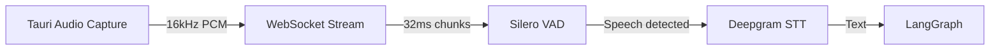

# Voco V2: Technical Design Document (TDD)

## 1. System Architecture

Voco V2 implements a zero-trust hybrid architecture:

### Local Runtime (Tauri + React)
- **Security Layer:** Zero-trust MCP sandbox with filesystem validation
- **UI Layer:** Modern React 18 with Shadcn/UI components
- **Bridge Layer:** WebSocket protocol for cognitive engine communication
- **Auth Layer:** Supabase JWT + RLS policies

### Cloud Runtime (Python + LangGraph)
- **State Machine:** LangGraph for stateful AI orchestration
- **Audio Pipeline:** Real-time voice processing
- **Tool Execution:** Background job queue with validation
- **Data Layer:** Supabase with row-level security

## 2. Audio Pipeline (Sub-300ms)

### Voice Input


### Barge-In System
- **Detection:** 64ms sustained speech threshold
- **Action:** Immediate `halt_audio` WebSocket message
- **State:** Sets `barge_in_detected = true`
- **Recovery:** Graph re-routes to Orchestrator

### Voice Output
- **Engine:** Cartesia Text-to-Speech
- **Protocol:** Chunked audio streaming
- **Format:** 24kHz MP3 frames
- **Latency:** ~100ms first-byte

## 3. LangGraph State Machine

### Core State Schema
```python
@dataclass
class VocoState:
    # Session context
    thread_id: str
    user_id: str
    project_id: str
    domain: str
    
    # Conversation state
    messages: list[Message]
    barge_in_detected: bool
    pending_mcp_action: Optional[dict]
    
    # Background jobs
    job_queue: BackgroundJobQueue
    pending_rpc_futures: dict[str, Future]
```

### Node Types

#### Orchestrator Node
```python
def orchestrate(state: VocoState) -> VocoState:
    if state.barge_in_detected:
        return handle_interruption(state)
        
    if state.pending_mcp_action:
        return await_user_approval(state)
        
    return route_to_model(state)
```

#### Model Router Node
```python
def route_to_model(state: VocoState) -> str:
    # Route between Sonnet/Haiku based on:
    # 1. Message complexity
    # 2. Tool requirements
    # 3. Context length
    return "sonnet" if needs_complex_reasoning(state) else "haiku"
```

#### Background Job Node
```python
async def process_jobs(state: VocoState) -> VocoState:
    # Process job queue in parallel
    results = await asyncio.gather(*[
        job.execute() for job in state.job_queue
    ])
    return update_state_with_results(state, results)
```

## 4. Zero-Trust MCP Integration

### Security Model
```rust
// src-tauri/src/commands.rs
#[tauri::command]
async fn execute_mcp_action(action: McpAction) -> Result<(), Error> {
    // 1. Validate filesystem scope
    validate_path(&action.path)?;
    
    // 2. Check for high-risk operations
    if is_high_risk(&action) {
        let approved = request_user_approval(&action).await?;
        if !approved {
            return Err(Error::CommandRejected);
        }
    }
    
    // 3. Execute with timeout
    tokio::time::timeout(
        Duration::from_secs(30),
        execute_sandboxed(action)
    ).await??
    
    Ok(())
}
```

### WebSocket Protocol

#### Cognitive Engine → Tauri
```typescript
type McpRequest = {
    id: string;
    action: "read_file" | "execute_command";
    payload: any;
};
```

#### Tauri → Cognitive Engine
```typescript
type McpResponse = {
    id: string;
    status: "success" | "error" | "rejected";
    result?: any;
    error?: string;
};
```

## 5. Enterprise Features

### Billing Integration
- Stripe Metered API for usage tracking
- Background job for aggregating turns
- Webhook handler for subscription events
- Automatic seat management

### Security & Compliance
- JWT-based authentication
- Row-level security policies
- Audit logging of all actions
- SOC 2 compliance controls